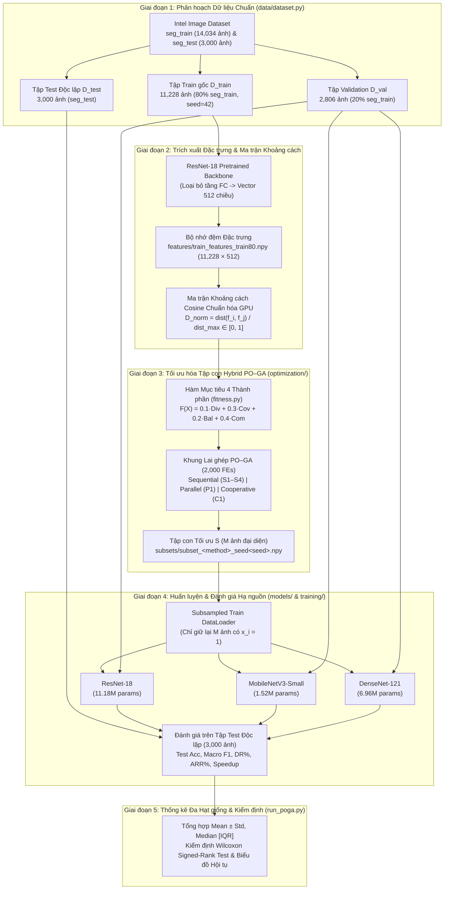
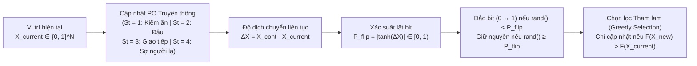
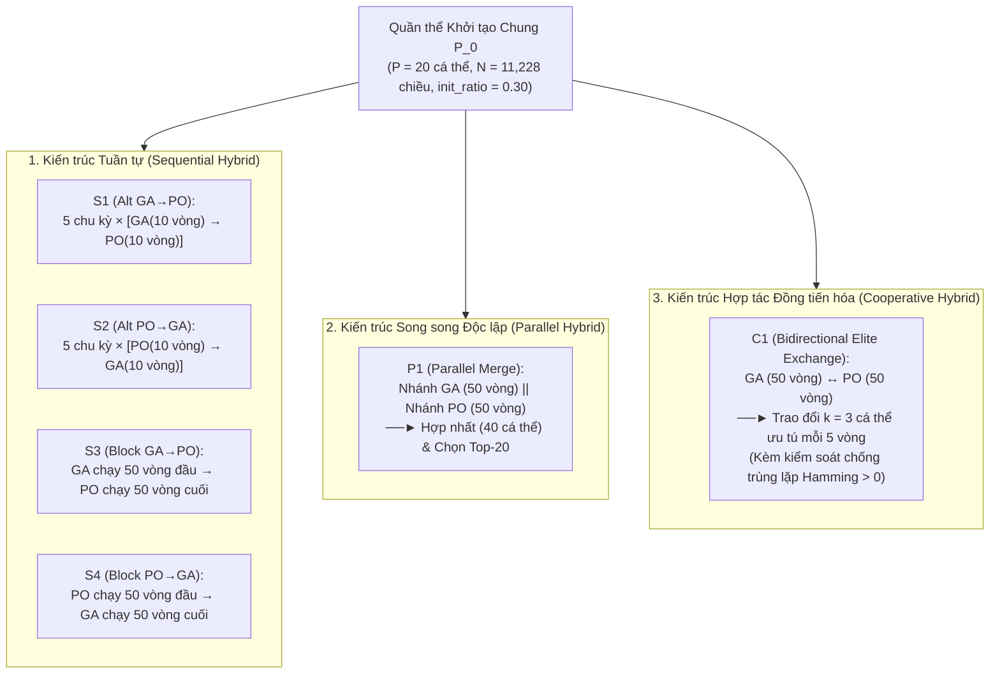

# KIẾN TRÚC HỆ THỐNG RÚT GỌN DỮ LIỆU ẢNH HYBRID PO–GA (`CNTT-KLCN140`)

Tài liệu này mô tả chi tiết kiến trúc tổng thể, luồng dữ liệu 5 giai đoạn (End-to-End Dataflow), sơ đồ tương tác giữa các mô-đun và cơ chế vận hành của 3 nhóm kiến trúc lai hóa **Parrot Optimizer – Genetic Algorithm (Hybrid PO–GA)** trong dự án.

---

## 1. Sơ đồ Luồng Xử lý Tổng thể 5 Giai đoạn (End-to-End Pipeline)

Hệ thống được thiết kế theo mô hình **Filter-based Coreset Selection** tách biệt hoàn toàn giữa Tầng Tối ưu hóa Tổ hợp (Giai đoạn 3) và Tầng Huấn luyện Đánh giá Học sâu (Giai đoạn 4), giúp tìm tập ảnh đại diện chỉ trong vài chục giây mà không cần huấn luyện lại mạng CNN ở từng vòng lặp tiến hóa.



---

## 2. Cấu trúc Thư mục và Phân tầng Mô-đun (Module Architecture)

```text
KhoaLuanDatasetReduction/
├── configs/
│   ├── __init__.py
│   └── config.py                  # Quản lý tập trung BaselineConfig, POGAConfig, GAConfig, POConfig, FitnessConfig
│
├── data/
│   ├── __init__.py
│   └── dataset.py                 # Phân hoạch Train/Val/Test, lọc tập con theo mask .npy & trích xuất đặc trưng ResNet-18
│
├── features/
│   ├── train_features_train80.npy # Vector đặc trưng 512 chiều tiền trích xuất của 11,228 ảnh Train (~21 MB)
│   └── train_labels_train80.npy   # Nhãn phân lớp (0..5) tương ứng của 11,228 ảnh Train
│
├── optimization/
│   ├── __init__.py
│   ├── fitness.py                 # Ma trận khoảng cách Cosine chuẩn hóa trên GPU & Hàm Fitness 4 thành phần (Div, Cov, Bal, Com)
│   ├── genetic_algorithm.py       # Giải thuật Di truyền (Tournament Selection, Uniform Crossover, Adaptive Mutation, Elitism)
│   ├── parrot_optimizer.py        # Thuật toán Đàn vẹt truyền thống (4 hành vi St=1..4, Lévy Flight) + Ánh xạ nhị phân |tanh(Δx)|
│   └── hybrid_poga.py             # 6 cấu hình lai hóa (S1, S2, S3, S4, P1, C1) & 2 phương pháp đối chuẩn (Random, Stratified)
│
├── models/
│   ├── __init__.py
│   └── model.py                   # Khởi tạo 3 kiến trúc CNN: ResNet-18, MobileNetV3-Small, DenseNet-121
│
├── training/
│   ├── __init__.py
│   └── trainer.py                 # Vòng lặp huấn luyện Adam + StepLR, lưu best_model_weights theo Val Acc & chấm điểm Test Set
│
├── utils/
│   ├── __init__.py
│   └── utils.py                   # Cố định seed tái lập, vẽ biểu đồ hội tụ, learning curves & confusion matrix
│
├── train.py                       # Kịch bản huấn luyện mốc chuẩn Full Dataset (B0) hoặc huấn luyện đơn lẻ 1 tập con
├── run_poga.py                    # Kịch bản điều phối thực nghiệm toàn diện (Tầng 1 + Tầng 2 + Thống kê Wilcoxon)
├── kaggle_poga_notebook.ipynb     # Notebook tự động hóa thực thi trên đám mây Kaggle GPU
├── BAO_CAO_KHOA_LUAN_CNTT_KLCN140.md        # Báo cáo toàn văn Khóa luận Tốt nghiệp (Chương 1 -> Chương 8)
└── BAO_CAO_KET_QUA_THUC_NGHIEM_POGA.md      # Báo cáo chuyên biệt phân tích kết quả thực nghiệm Kaggle
```

---

## 3. Kiến trúc Chi tiết Mô-đun Tối ưu hóa (`optimization/`)

### 3.1. Cơ chế Ánh xạ Nhị phân trong Parrot Optimizer (`parrot_optimizer.py`)

Thuật toán Parrot Optimizer truyền thống (Lian et al., 2024) cập nhật vị trí cá thể trên miền liên tục $X_i^{\text{cont}} \in \mathbb{R}^N$ thông qua 4 phương trình hành vi ($S_t \in \{1, 2, 3, 4\}$). Để biểu diễn quyết định chọn ($1$) hoặc loại bỏ ($0$) từng bức ảnh, hệ thống sử dụng hàm truyền chữ V ($V(\Delta x) = |\tanh(\Delta x)|$) ở bước cuối của mỗi vòng lặp:



### 3.2. Ba Nhóm Kiến trúc Lai hóa PO–GA (`hybrid_poga.py`)

Tất cả 6 cấu hình lai hóa đều nhận cùng một quần thể khởi tạo $P_0$ tại mỗi `seed` và chia sẻ cùng tổng ngân sách đánh giá hàm mục tiêu là **$\text{Total FEs} = 2.000$** ($P = 20, T = 100$):



---

## 4. Cơ chế Tối ưu Hiệu năng Tính toán (Performance Engineering)

1. **Tiền trích xuất và Lưu đệm Đặc trưng (`features/train_features_train80.npy`)**:
   - Toàn bộ $11.228$ ảnh của tập huấn luyện $D_{\text{train}}$ được trích xuất sẵn một lần duy nhất qua mạng `ResNet-18` thành ma trận `float32` kích thước $11.228 \times 512$ ($\approx 21\text{ MB}$).
   - Các phiên chạy tối ưu hóa nạp trực tiếp ma trận này từ ổ đĩa vào RAM trong $< 0,05$ giây, loại bỏ hoàn toàn nút thắt đọc/giải mã file ảnh JPEG.
2. **Tiền tính toán Khoảng cách bằng Nhân Ma trận BLAS (`precompute_distance_matrix`)**:
   - Ma trận khoảng cách Cosine $11.228 \times 11.228$ được tính bằng phép nhân ma trận chuẩn hóa $\hat{F}\hat{F}^\top$ (`float32` BLAS) và chia trực tiếp cho $\text{dist}_{\max}$ chỉ trong $\approx 1,2$ giây.
3. **Lưu đệm Tensor Khoảng cách trên Bộ nhớ GPU (`_get_dist_tensor`)**:
   - Ma trận khoảng cách $\hat{D}$ ($\approx 504\text{ MB}$) được giữ cố định trên VRAM GPU (`cuda`), cho phép hai phép toán tốn kém nhất là tính Độ đa dạng ($\text{Div}$ — cắt ma trận con $M \times M$) và Độ bao phủ ($\text{Cov}$ — tìm $\min$ trên ma trận $N \times M$) thực thi song song trên nhân CUDA.
